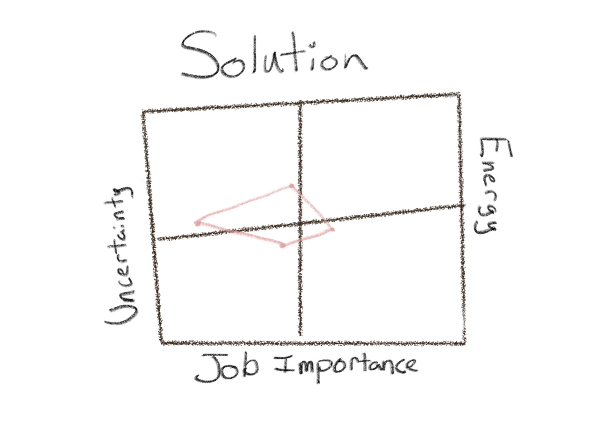
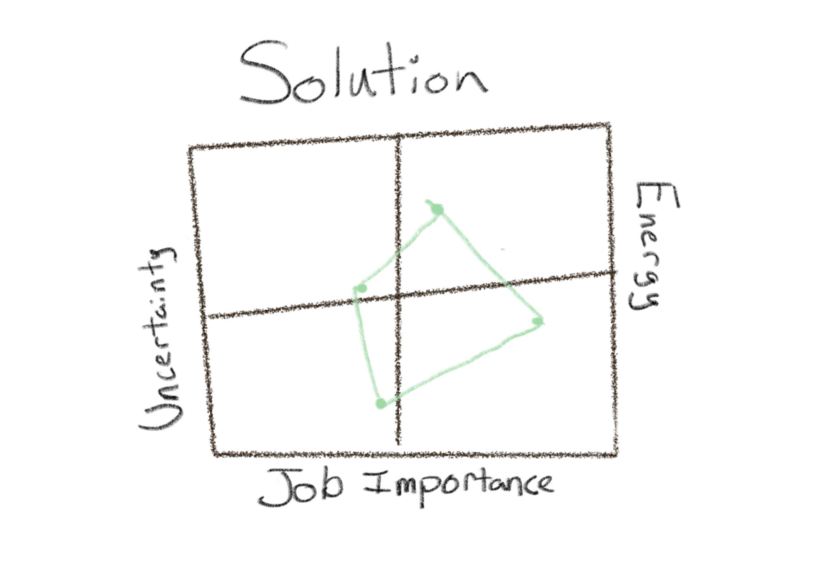

Curiosity is a funny thing. It’s almost compulsive. Something sparks a thought or interest and suddenly you find yourself probing for more information. It becomes a desire; a need to be fulfilled. Maybe it’s a tickle in the back of your mind that doesn’t derail what you’re doing. Instead the thought festers until the time is right to come back to it. Or, you forget about the thought entirely. Maybe how curiosity manifests is entirely dependant on the situation—some things pull you in deep, other things let you go just as quickly as they came into your life.

No matter how you felt in that moment, there was something presented to you that piqued your interested and you felt compelled to learn about it. It was a mystery whose curtain was shiny and enticed you to grab hold and move aside to find the answer, no matter how heavy it was.

Yet, that pushing of the curtain isn’t always pleasant. In-fact, there’s a close relative to curiosity that shares a lot of the same traits but doesn’t contain the same joy or delight: confusion

There’s a difference between curiosity and confusion that’s pretty subtle in nature; one being more frustrating, the other more inviting. Yet, the lead up is the same. It’s a lack of clarity in a moment; a tension that wants to be resolved.

Curiosity is often playful or exciting. You’re pulled in to learn more about something because it piques an interest. It feels like there’s a better you on the other side. That once you cross the chasm of the unknown to known, the secrets of the universe—or at least which power ranger turned good to bad to good again—will be unlocked. There might still be a sense of anxiety—a fidgety-ness—behind curiosity, but the Job to be Done is likely of lower importance.

Confusion seems to have the opposite trait. There’s another side you’re looking to get to, but there’s a road block. A road block where the path isn’t clear to you. It’s obscuring your ability to see and become this other you. The you with new information swirling around the floating grey matter in your skull. This friction creates frustration. It’s a negative experience, and it’s likely something you’ll want to mention in your ~~therapy session~~ group chat a quickly as possible.

Why is this worth pointing out? Well, as someone in product, I think this distinction is _super important_ to building world-class products.

As builders and product-people, we want to foster a sense of **_curiosity_** not **_confusion_**, and sometimes it can be hard to build for one without creating the other. This connection has become more and more clear as we build version 2 of Fluent. And while it may seem obvious to a lot of folks reading this, the connection between the two didn’t become apparent to me until doing user interviews for _our product specifically_. Other products I’ve built in the past had points of frustration but often because of something missing, not because of something affecting your **state of being**.

Fluent is an environmental product. We’re an augmented reality game that lives on-top of your browsing experience. We add information and elements that change your regular browsing environment to one that is conducive to learning vocabulary in another language. This can really mess with people! We’re no longer just building a game people are dedicating time to, _we’re building a game that lives within, and modifies, their regular lives._

As the creators, the interactions are expected by us. We built the damn thing. Which is why it’s even more important that we continue to [Eat Shit](/personal/eating-shit) on a regular basis to understand the blindspots we’ve developed by living in our augmented reality world daily. We no longer ride the line between curiosity and confusion, we’ve hit acceptance and understanding of our product long, long ago! It’s much easier for us to lose a sense of what will create confusion and what will create curiosity. Often times we try to create one, and accidentally create the other.

From these user observations and interviews, I’ve started to notice a pattern with how curiosity and confusion manifest. These are the 2 most common scenarios we’ve seen so far:

## Confused Thoughts

There’s an uncertainty in front of me but I can’t find the path to making this situation more certain. I don’t want to spend my energy figuring this uncertainty out—why do I have to go on this hunt? Why can’t you _tell me_ what I need to do next? The task at hand is a small step towards my goal and I can’t complete it. Why are you slowing my progress?

## Curious Thoughts

There’s an uncertainty in front of me and I can think of a few potential solutions to solve this uncertainty. I’m excited to spend the energy to attempt these solutions or figure out new solutions to solve this problem because the task is important for me to solve at this point in time, and the potential solutions are fairly clear to me.

Looking at the situations through these lenses led me to believe there’s 4 variables at play here:

- Level of Uncertainty
- Clarity of potential solution(s)
- Energy
- Job Importance

The first thing that came to mind was plotting this on a radar chart of sorts. The boundaries of the chart show very rough, totally made up, spheres of confusion or curiosity.

### Confusion Radar Chart

What seems to lead to confusion is a high level of uncertainty, low job importance, low energy and a lack of clear paths to solutions. People who’re presented with problems that don’t have a clear enough path to resolution will end up being frustrated. That moment of uncertainty likely won’t shift to a moment of delight, it’ll just leave them deflated and without a sense of direction. “What’s next? Where do I go? Why is this getting in my way?” The big thing I’ve noticed lately is that people tend to be more frustrated, _especially when the importance of the job is low_. The lower the importance of the job, the less likely people are willing to jump through hoops. Great examples of this are signing up before using a product. The sign-up process has to be directly proportional to the effort of the job they’re trying to complete.

### Curiosity Radar Chart

Moments of uncertainty that lead to curiosity typically have **less uncertainty that you might think.** Often times there’s an _idea of a path to resolution_ that’s already present. In cases where that isn’t true, but the job is completed, it’s likely because the importance of the job or the energy levels are extremely high.

The key difference between curiosity and confusion seems to be there’s an escape hatch in moments of uncertainty. Something that calls out to the person in the moments that clues them in to the next step, often leading them to wanting to see what’s behind door number 2. When that opportunity doesn’t present itself, it’s the same as opening a door that leads you to a brick wall. The curiosity stops and is instead traded for confusion, which ultimately leads to frustration.

It’s something we’re really trying to keep in mind at Fluent now. Especially when it comes to setting up the rules of our game. What pay-offs are we saying are at the end of this journey? Can we follow through on them? When building micro-interactions, are we setting people up for confusion or curiosity?

I think when you’re _making the thing_ it’s really, **really** easy to get caught up in what _you’re_ doing, and forget the journey from the outside. Purposefully forgetting the context of what you’ve done, where you’re going and who you are is tough. But it’s probably the most important thing you can train when building for people other than yourself. And, I think this model is going to be something that I’ll be able to use to measure what we’re doing to make sure it falls within the boundaries of curiosity and doesn’t tip someone over to confusion, ultimately leading to frustration.
